# 🌐 AWS VPC Resources

## 🚀 Project Overview

This project demonstrates the implementation of a custom Virtual Private Cloud (VPC) architecture in AWS. The project focuses on creating and configuring networking resources such as VPCs, subnets, route tables, internet gateways, security groups, network ACLs, and EC2 instances.

The objective of this project was to understand AWS networking fundamentals, resource isolation, traffic routing, and secure communication within a cloud environment.

---

## ✅ Project Status

**Completed Successfully**

---

## 🎯 Objectives

- Understand AWS VPC fundamentals
- Create Public and Private Subnets
- Configure Internet Gateway
- Configure Route Tables
- Configure Subnet Associations
- Create Security Groups
- Create Network ACLs
- Launch EC2 Instances in Different Subnets
- Understand AWS Networking Architecture
- Implement Secure Network Design

---

## ✨ Features

- 🌐 Custom VPC Creation
- 🏠 Public Subnet Configuration
- 🔒 Private Subnet Configuration
- 🚪 Internet Gateway Configuration
- 🛣️ Route Table Configuration
- 🔗 Subnet Association Management
- 🛡️ Security Group Configuration
- 🚧 Network ACL Configuration
- 💻 Public and Private EC2 Instances
- ☁️ AWS Networking Architecture

---

## 🛠️ Services Used

### AWS Services

- Amazon VPC
- Amazon EC2
- Internet Gateway
- Route Tables
- Security Groups
- Network ACLs

### Tools

- AWS Management Console
- GitHub

---

## 🏗️ Project Architecture

```text
AWS Cloud
│
├── VPC
│
├── Public Subnet
│      │
│      └── Public EC2 Instance
│
├── Private Subnet
│      │
│      └── Private EC2 Instance
│
├── Internet Gateway
│
├── Route Table
│
├── Security Group
│
└── Network ACL
```

---

## 🔑 Key Skills Demonstrated

- AWS Networking
- Virtual Private Cloud (VPC)
- Public & Private Subnets
- Internet Gateway Configuration
- Route Table Management
- Security Group Configuration
- Network ACL Configuration
- EC2 Networking
- Cloud Security Fundamentals
- AWS Infrastructure Management

---

## 🚀 Implementation Steps

1. Selected AWS Region
2. Created Custom VPC
3. Created Public Subnet
4. Created Private Subnet
5. Created Internet Gateway
6. Attached Internet Gateway to VPC
7. Created Route Table
8. Added Internet Route
9. Configured Subnet Association
10. Created Security Group
11. Created Network ACL
12. Launched Public EC2 Instance
13. Launched Private EC2 Instance
14. Verified VPC Resource Map
15. Verified Network Connections
16. Verified VPC Workflow
17. Deleted Resources After Testing

---
# 📸 Screenshots

## 1. Region Selected

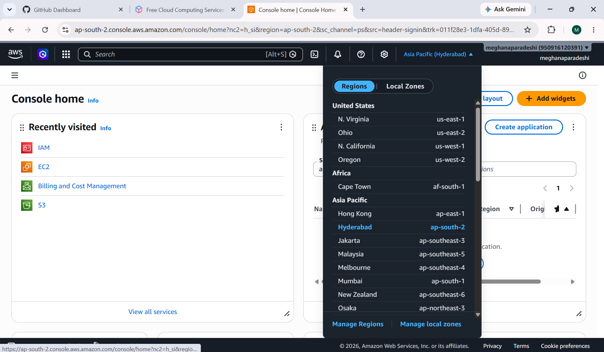

## 2. VPC Created

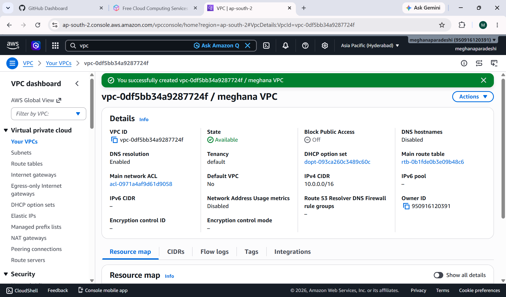

## 3. Public Subnet Created

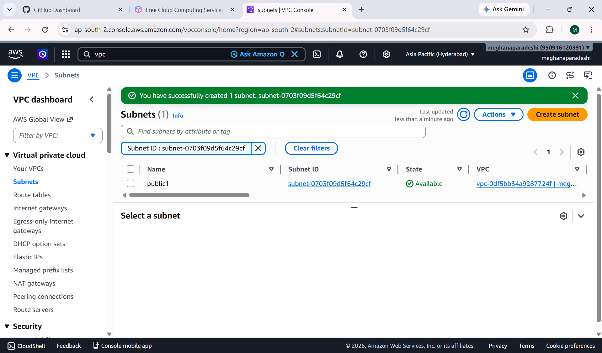

## 4. Private Subnet Created

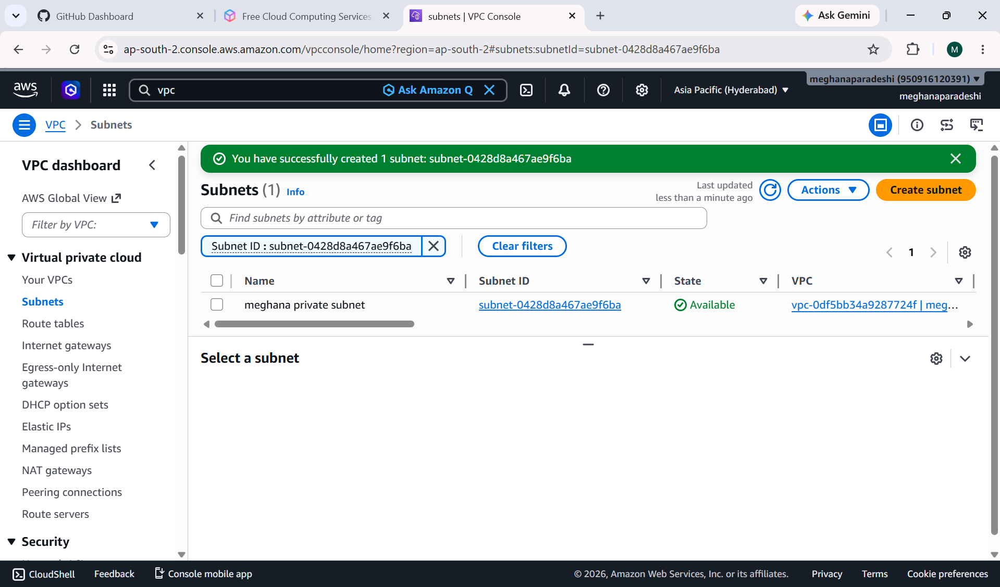

## 5. Internet Gateway Created

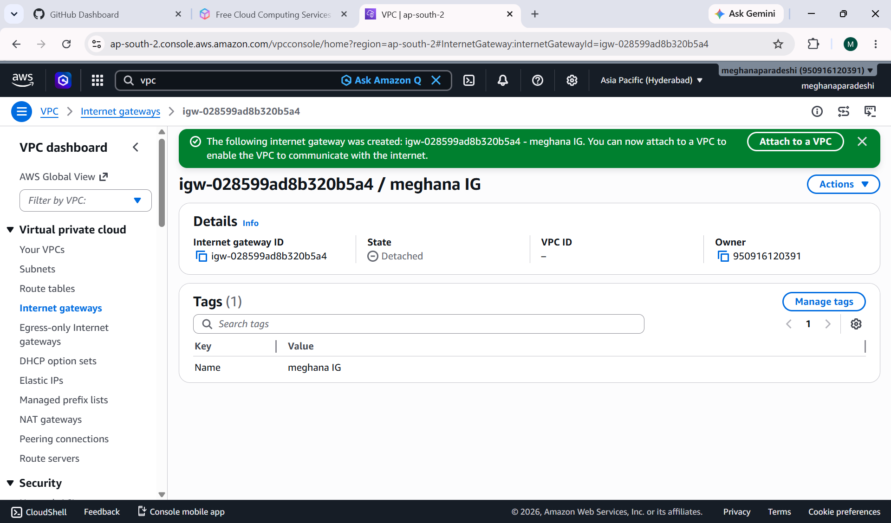

## 6. Internet Gateway Attached to VPC

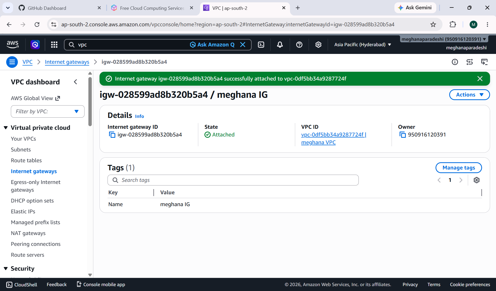

## 7. Route Table Created

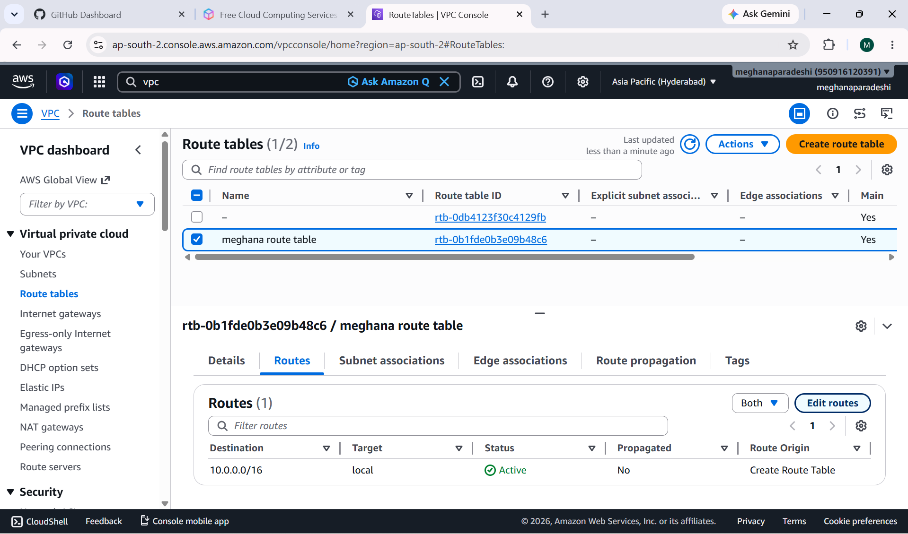

## 8. Route Added

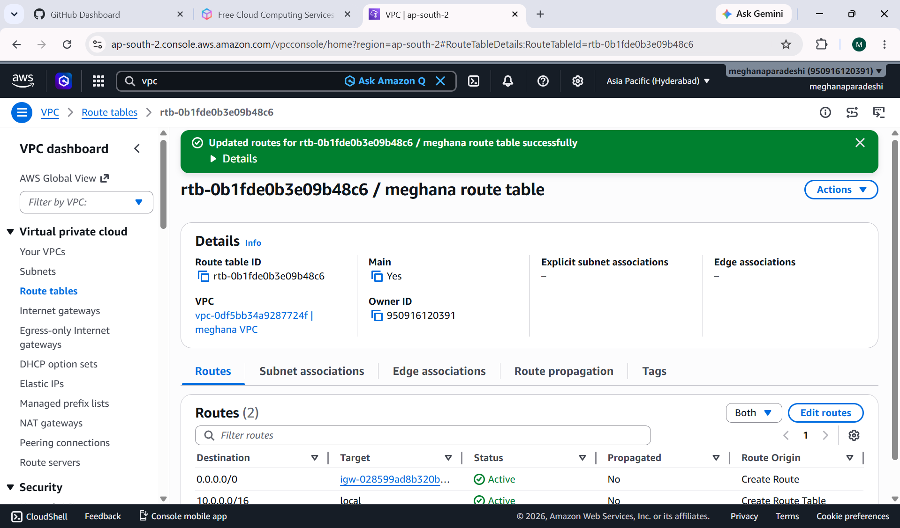

## 9. Subnet Association

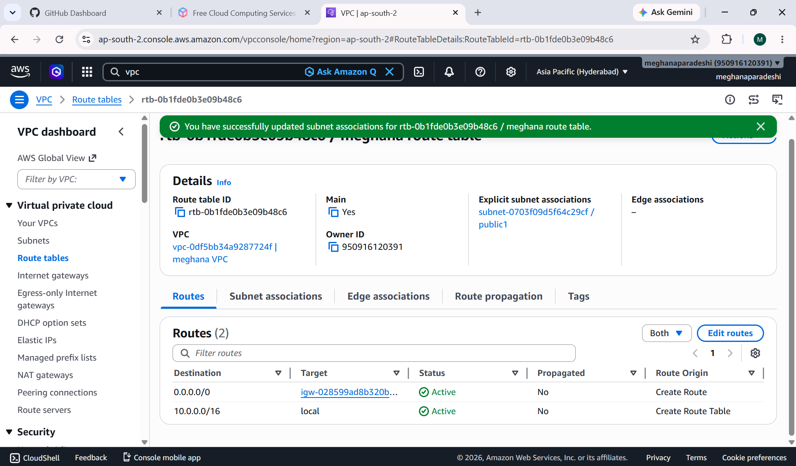

## 10. Security Group Created

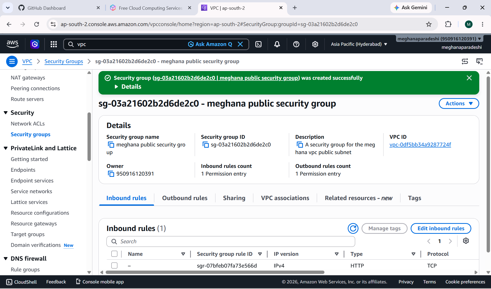

## 11. Network ACL Created

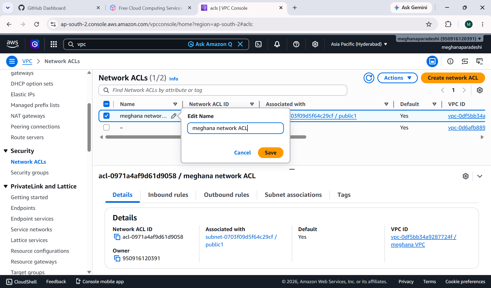

## 12. Public EC2 Instance Created

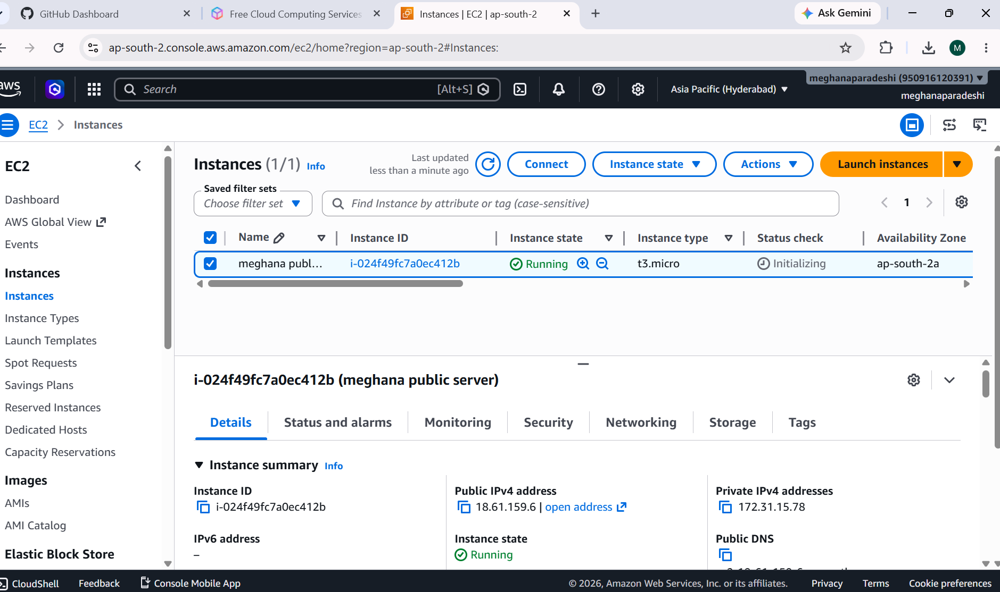

## 13. Private EC2 Instance Created

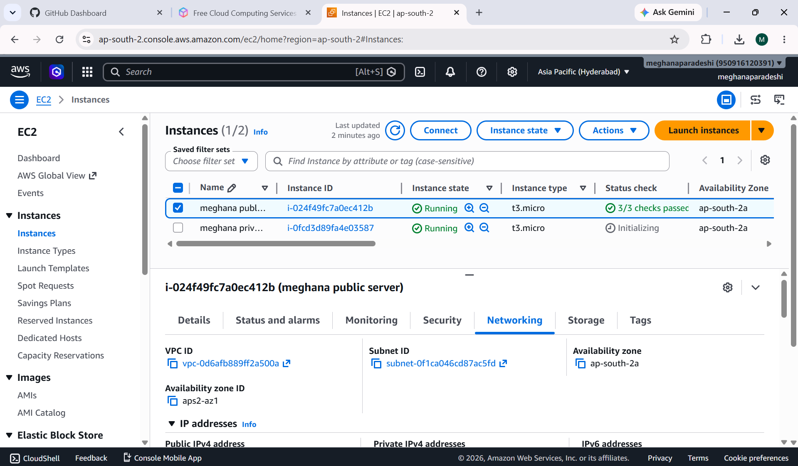

## 14. VPC Workflow

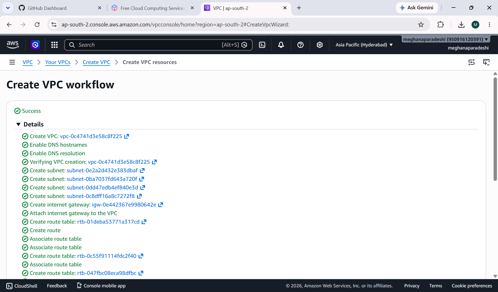

## 15. VPC Resource Map

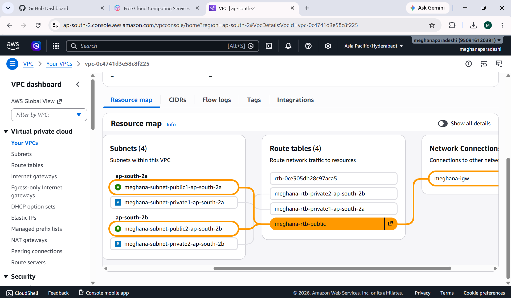

## 16. Network Connections

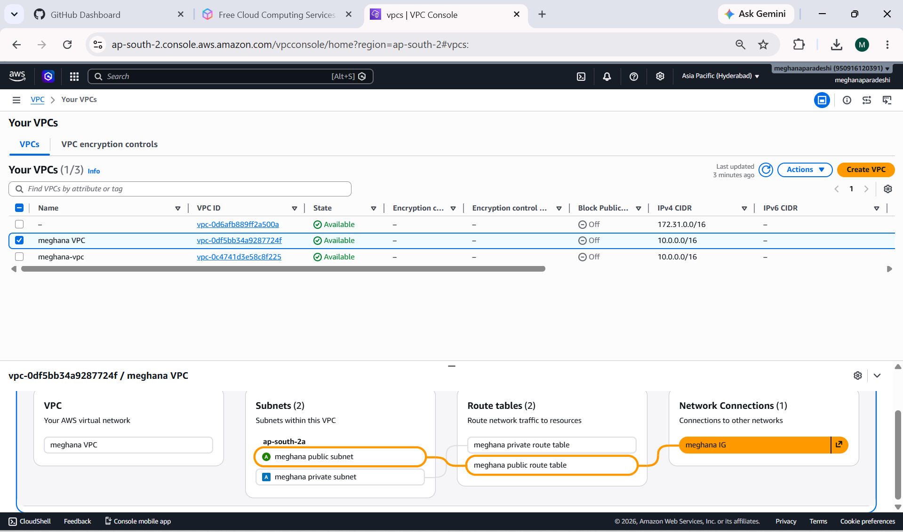

---

## 🐞 Challenges Faced

### Network Configuration Validation

#### Challenge

Ensuring that networking resources were properly connected and associated.

#### Solution

- Verified subnet associations
- Verified route table configurations
- Verified Internet Gateway attachment
- Reviewed VPC Resource Map
- Checked network connections

---

## 📚 What is AWS VPC?

Amazon VPC (Virtual Private Cloud) is a logically isolated virtual network within AWS that allows users to launch and manage AWS resources securely.

A VPC provides complete control over:

- IP Address Range
- Subnets
- Route Tables
- Internet Connectivity
- Security Rules

---

## 🎓 Learning Outcomes

- AWS VPC Fundamentals
- Public and Private Subnets
- Internet Gateway Configuration
- Route Table Management
- Security Group Configuration
- Network ACL Configuration
- EC2 Networking
- Cloud Networking Fundamentals
- AWS Infrastructure Design

---

## 🔮 Future Enhancements

- Implement NAT Gateway
- Configure Bastion Host
- Deploy Multi-AZ Architecture
- Add Load Balancer
- Connect VPCs using VPC Peering
- Implement Hybrid Connectivity

---

## 📝 Note

All AWS resources created during this project were deleted after successful testing to avoid unnecessary AWS charges and follow cloud cost-management best practices.

---

## 👩‍💻 Author

**Meghana Paradeshi**

Aspiring Cloud Engineer

GitHub: https://github.com/meghana1125-ui

---

## ⭐ Support

If you found this project useful, consider giving it a ⭐ on GitHub.
